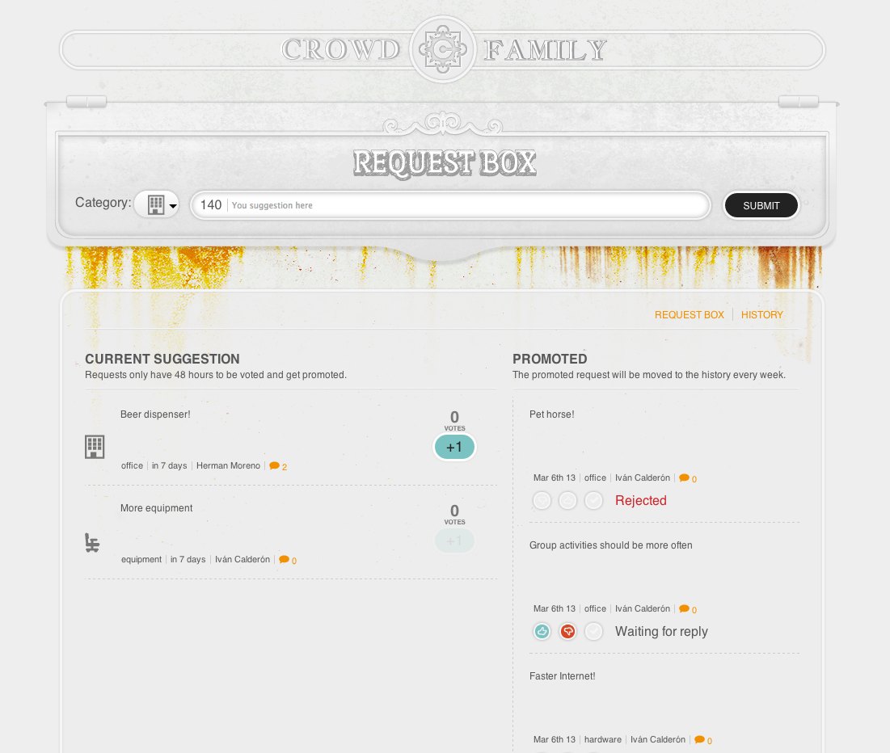
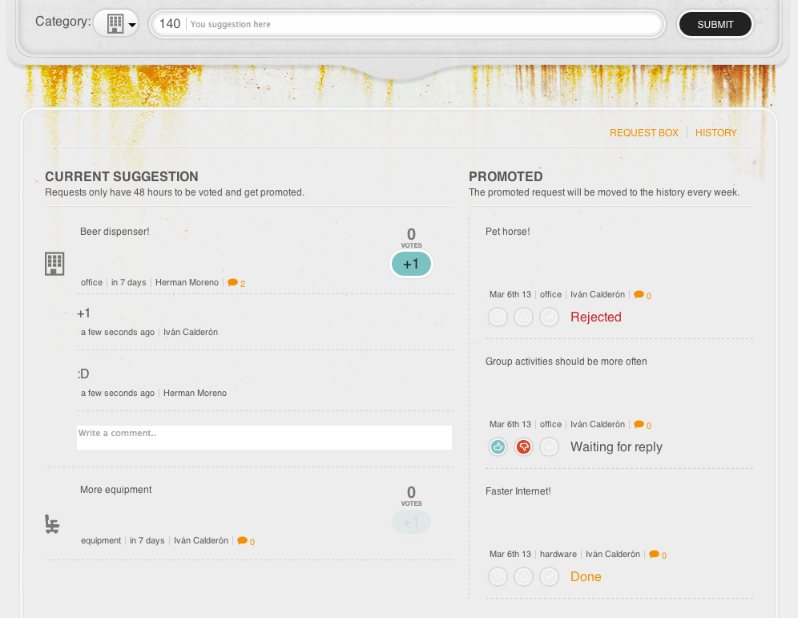

[](https://travis-ci.org/crowdint/requests-crowdint-com)

#Crowd-Requests

###[http://requests.crowdint.com](http://requests.crowdint.com/)

**Crowd-requests** is a web application created to give valuable feedback about the flaws, problems and things that could improve here @**CrowdInt** so we can fix them.

Any member of the **CrowdInt** team can use the application and leave a **requests** about what he/she would like to see or change in the working environment (could be anything!).

 
 
 
Action buttons (for Admins only)
 
 

## Setup


### Gems

```
bundle install
```

### Database

```
bundle exec rake db:create
bundle exec rake db:migrate
```

### Environment variables for local development
	export VOTES_LIMIT=10

### Run

```
rails s
```